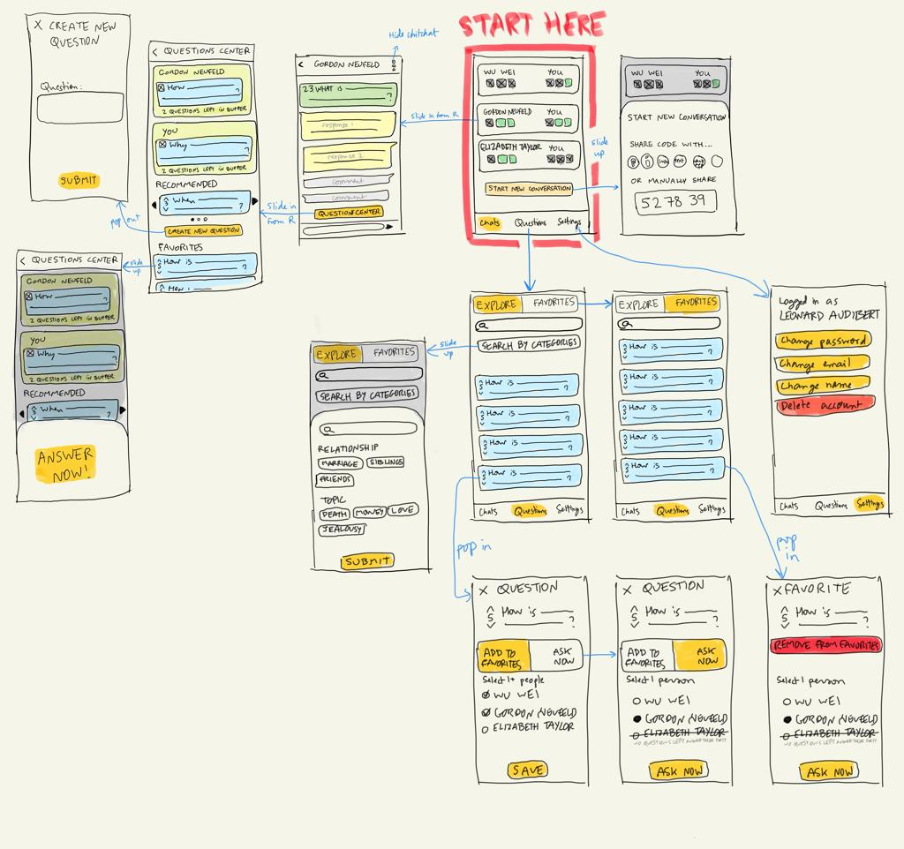
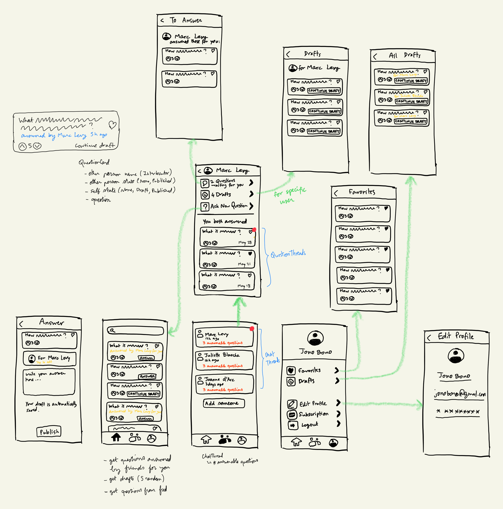

# ChatBond

## Project Overview

Introducing "ConvoConnect" - A Revolutionary App to Rekindle Relationships and Spark Meaningful Conversations

In today's fast-paced world, it's easy to feel disconnected from our loved ones. We often find ourselves lost in superficial interactions that lack depth and genuine connection. That's where ConvoConnect comes in - an innovative app designed to help you reconnect and nurture relationships through meaningful conversations.

ConvoConnect is a unique platform that brings people together in conversation threads, creating an engaging and immersive experience. Our smart algorithm suggests thought-provoking questions that encourage self-reflection, promote empathy, and deepen understanding between participants. You can also choose your own questions to spark discussions tailored to your interests and relationships.

Here's how ConvoConnect works:

Create a conversation thread and invite your friends, family, or loved ones to participate.
Each person is presented with a question, either chosen by them or suggested by our intelligent algorithm.
Participants take their time to answer the question thoughtfully and honestly, sharing their insights and experiences.
Once everyone has answered, the responses are unveiled to all, fostering meaningful discussions and providing a safe space for vulnerability and growth.
With ConvoConnect, you'll find yourself engaged in purposeful conversations that strengthen bonds and enrich your relationships. Our app is designed to bridge the gap between loved ones, no matter the physical distance, by offering a platform to share thoughts, feelings, and life experiences in a nurturing and supportive environment.

Don't let the fast-paced digital world pull you further apart from those who matter most. Let ConvoConnect help you rediscover the beauty of genuine connection and meaningful conversation. Download ConvoConnect now and start nurturing your relationships today!

# Example Text
## Invitations:
- Hey Mike! 😄 Let's catch up on ConvoConnect, an amazing app for deep and engaging conversations! Join our shared chat using this link: http://chatbond.io/iuhnrg 🎉✨

- Mike, guess what? 🤩 We can rekindle our connection on ConvoConnect, an awesome app designed for meaningful chats! Hop into our shared convo here: http://chatbond.io/iuhnrg 🌈🚀

- Hi Mike! 😊 Time to reconnect on ConvoConnect, a fantastic app that fosters thoughtful conversations! Click this link and join our special chat: http://chatbond.io/iuhnrg 🌟🎈

- Hey Mike! 🎉 Let's dive into some heartfelt conversations on ConvoConnect, a super fun app for deeper connections! Access our shared chat using this link: http://chatbond.io/iuhnrg 🤗💫

- Mike! 👋 Let's get talking on ConvoConnect, the perfect app for inspiring conversations that matter! Join our cozy chat space here: http://chatbond.io/iuhnrg 💌🌠
---

![coverage][coverage_badge]
[![style: very good analysis][very_good_analysis_badge]][very_good_analysis_link]
[![License: MIT][license_badge]][license_link]

Generated by the [Very Good CLI][very_good_cli_link] 🤖

A Very Good Project created by Very Good CLI.

---

## Getting Started 🚀

This project contains 3 flavors:

- development
- staging
- production

More info on flavors [in this blog post](https://medium.com/@animeshjain/build-flavors-in-flutter-android-and-ios-with-different-firebase-projects-per-flavor-27c5c5dac10b).

To run the desired flavor either use the launch configuration in VSCode/Android Studio or use the following commands:

```sh
# Development
$ flutter run --flavor development --target lib/main_development.dart

# Staging
$ flutter run --flavor staging --target lib/main_staging.dart

# Production
$ flutter run --flavor production --target lib/main_production.dart
```

_\*ChatBond works on iOS, Android, Web, and Windows._

### Very Good Analysis

Run `flutter analyze` to enforce best practices.

---

## Running Tests 🧪

To run all unit and widget tests use the following command:

```sh
$ flutter test --coverage --test-randomize-ordering-seed random
```

To view the generated coverage report you can use [lcov](https://github.com/linux-test-project/lcov).

```sh
# Generate Coverage Report
$ genhtml coverage/lcov.info -o coverage/

# Open Coverage Report
$ open coverage/index.html
```

---

## Working with Translations 🌐

This project relies on [flutter_localizations][flutter_localizations_link] and follows the [official internationalization guide for Flutter][internationalization_link].

### Adding Strings

1. To add a new localizable string, open the `app_en.arb` file at `lib/l10n/arb/app_en.arb`.

```arb
{
    "@@locale": "en",
    "counterAppBarTitle": "Counter",
    "@counterAppBarTitle": {
        "description": "Text shown in the AppBar of the Counter Page"
    }
}
```

2. Then add a new key/value and description

```arb
{
    "@@locale": "en",
    "counterAppBarTitle": "Counter",
    "@counterAppBarTitle": {
        "description": "Text shown in the AppBar of the Counter Page"
    },
    "helloWorld": "Hello World",
    "@helloWorld": {
        "description": "Hello World Text"
    }
}
```

3. Use the new string

```dart
import 'package:chatbond/l10n/l10n.dart';

@override
Widget build(BuildContext context) {
  final l10n = context.l10n;
  return Text(l10n.helloWorld);
}
```

### Adding Supported Locales

Update the `CFBundleLocalizations` array in the `Info.plist` at `ios/Runner/Info.plist` to include the new locale.

```xml
    ...

    <key>CFBundleLocalizations</key>
	<array>
		<string>en</string>
		<string>es</string>
	</array>

    ...
```

### Adding Translations

1. For each supported locale, add a new ARB file in `lib/l10n/arb`.

```
├── l10n
│   ├── arb
│   │   ├── app_en.arb
│   │   └── app_es.arb
```

2. Add the translated strings to each `.arb` file:

`app_en.arb`

```arb
{
    "@@locale": "en",
    "counterAppBarTitle": "Counter",
    "@counterAppBarTitle": {
        "description": "Text shown in the AppBar of the Counter Page"
    }
}
```

`app_es.arb`

```arb
{
    "@@locale": "es",
    "counterAppBarTitle": "Contador",
    "@counterAppBarTitle": {
        "description": "Texto mostrado en la AppBar de la página del contador"
    }
}
```

[coverage_badge]: coverage_badge.svg
[flutter_localizations_link]: https://api.flutter.dev/flutter/flutter_localizations/flutter_localizations-library.html
[internationalization_link]: https://flutter.dev/docs/development/accessibility-and-localization/internationalization
[license_badge]: https://img.shields.io/badge/license-MIT-blue.svg
[license_link]: https://opensource.org/licenses/MIT
[very_good_analysis_badge]: https://img.shields.io/badge/style-very_good_analysis-B22C89.svg
[very_good_analysis_link]: https://pub.dev/packages/very_good_analysis
[very_good_cli_link]: https://github.com/VeryGoodOpenSource/very_good_cli

# Interesting Flutter Ressources

- [Top Flutter & Dart packages in 2022, from Very Good Ventures](https://verygood.ventures/blog/top-flutter-dart-packages)
- [Very good layered architecture in Flutter, with links to good model repos](https://verygood.ventures/blog/very-good-flutter-architecture)

## Projects

### Chat

- [gyakhoe/flutter_chat](https://github.dev/gyakhoe/flutter_chat)
- [Fintasys/Flutter-Bloc-Firebase-Chat](https://github.dev/Fintasys/Flutter-Bloc-Firebase-Chat)

---

# Features

## Material Design

[Material](https://m2.material.io/)

## Offline data

[Flutter — Offline First, with Flutter_Data](https://levelup.gitconnected.com/flutter-offline-first-with-flutter-data-62bad61097be)

---

## Testing
### Answer Questions
* A user is able to answer a question for any number of friends. An already answered question for a friend can only be answered once.

## TODO:
* When a new question is answered, emit an event to add a new question thread in the proper question thread. This is important if the relevant question thread is in view. If no event is emitted, which should refresh that question threads' data, then the newly answered question WILL NOT show up as a question thread, until that page is reloaded by navigating away and back to it. The event could be QuestionAnsweredEvent and have the chatThread.id, so that if the chat thread is currently in view, it triggers a new GET from the BE.

# Designs

## 1.0



## 1.1



# Policies

## User Agreement

### CHATBOND USER AGREEMENT

THIS AGREEMENT IS A LEGAL CONTRACT BETWEEN YOU ("USER") AND CHATBOND ("COMPANY", "WE", "US", OR "OUR"). BY ACCESSING AND USING THE CHATBOND APP, YOU ARE ACCEPTING AND AGREEING TO THIS USER AGREEMENT ON YOUR OWN BEHALF AND/OR ON BEHALF OF YOUR COMPANY, ORGANIZATION, EDUCATIONAL INSTITUTION, OR AGENCY, INSTRUMENTALITY, OR DEPARTMENT OF THE FEDERAL GOVERNMENT AS ITS AUTHORIZED LEGAL REPRESENTATIVE.

#### Service Description

ChatBond provides an interactive platform for thoughtful and meaningful conversations amongst friends, family, and loved ones. Users create conversation threads, respond to questions and engage in enlightening discussions.

#### User Conduct

By agreeing to this User Agreement, you agree to:

Use ChatBond for lawful purposes and in accordance with this agreement.
Not use ChatBond to send, knowingly receive, upload, download, use, or re-use any material which does not comply with our content standards.
Not to impersonate or attempt to impersonate ChatBond, a ChatBond employee, another user, or any other person or entity.
Privacy and Personal Data

We take your privacy seriously. Our Privacy Policy, which describes how we handle your personal data and privacy when you use our service, is available on our website and is incorporated by reference into this agreement. By agreeing to this User Agreement, you also agree to our Privacy Policy.

#### Intellectual Property Rights

The content on ChatBond, including without limitation, the text, software, scripts, graphics, photos, sounds, music, videos, and the like ("Content") are owned by or licensed to ChatBond. Content on the website is provided to you AS IS for your information and personal use only and may not be used, copied, reproduced, distributed, transmitted, broadcast, displayed, sold, licensed, or otherwise exploited for any other purposes whatsoever without the prior written consent of the respective owners.

#### Changes to the User Agreement

We may revise this User Agreement at any time by amending this page. You are expected to check this page from time to time to take notice of any changes we made, as they are binding on you.

#### Termination

We may terminate or suspend your account and bar access to the service immediately, without prior notice or liability, under our sole discretion, for any reason whatsoever and without limitation, including but not limited to a breach of the User Agreement.

By using ChatBond, you are acknowledging that you have read, understood, and agree to be bound by this Agreement and comply with all applicable laws and regulations. If you do not agree with any part of this Agreement, you are not authorized to use or access ChatBond.

## Privacy and User Data

### CHATBOND PRIVACY AND PERSONAL DATA POLICY

#### Effective Date: July 11, 2023

ChatBond ("Company", "we", "us", or "our") respects your privacy and is committed to protecting it through our compliance with this privacy and personal data policy. This policy describes:

The types of information we may collect from you or that you may provide when you use the ChatBond application (our "App").
Our practices for collecting, using, maintaining, protecting, and disclosing that information.
### 1. INFORMATION WE COLLECT AND HOW WE COLLECT IT
We collect several types of information from and about users of our App, including information:

By which you may be personally identified, such as your user name, and email address ("personal information");
About your internet connection, the equipment you use to access our App, and usage details.
We collect this information:

Directly from you when you provide it to us.
Automatically as you navigate through the App.
### 2. HOW WE USE YOUR INFORMATION
We use information that we collect about you or that you provide to us, including any personal information:

To provide you with the App and its contents, and any other information, products or services that you request from us.
To provide you with notices about your account.
To notify you about changes to our App or any products or services we offer or provide through it.
To allow you to participate in interactive features on our App.
To improve our recommendation algorithms.
### 3. DISCLOSURE OF YOUR INFORMATION
We do not share, sell, or otherwise disclose your personal information for purposes other than those outlined in this Privacy Policy. However, we may disclose aggregated information about our users, and information that does not identify any individual, without restriction.

### 4. DATA SECURITY
We have implemented measures designed to secure your personal information from accidental loss and from unauthorized access, use, alteration, and disclosure.

### 5. CHANGES TO OUR PRIVACY POLICY
We post any changes we make to our privacy policy on this page. If we make material changes to how we treat our users' personal information, we will notify you through a notice on the App. The date the privacy policy was last revised is identified at the top of the page.

### 6. CONTACT INFORMATION
To ask questions or comment about this privacy policy and our privacy practices, contact us at: privacy@chatbond.com.

By using ChatBond, you are acknowledging that you have read, understood, and agree to be bound by this Privacy Policy. If you do not agree with any part of this Policy, you are not authorized to use or access ChatBond.

## Important links
 - Mailhog: http://localhost:8025/#
 - Django admin dashboard: http://localhost:8000/admin/login/ (need to do `python manage.py createsuperuser` before being able login, I usually use `leonard.audibert@gmail.com` and `testpassword` for dev.)
 - Django API: http://localhost:8000/api/docs/#/
 - Centrifugo dashboard: http://localhost:8080/ 


## WIP

### Bugs
- [x] When answering a question that has a draft, the number of drafts in profile page does not update immediately after navigating to it. It currently requires a restart to show prev number - 1.
  - [x] Similarly, the list of drafts in "drafts" still shows the just answered draft if the page was already active in the profile tab, after answering it in the people tab.
- [x] After answering a question in "Pending for you", the answered question still shows up in that list. It should be removed.
  - [ ] I suppose there is a similar issue for "Pending on other" -> Very low priority, see Nice To Haves in TODO
  - [x] Once a question is answered for 1 connected interlocutor, it shows as "Continue draft" even if there are no open drafts for other interlocutors. Shows the correct "Answer" button after logging in/out, so it's related to the widget not rebuilding due to failure to detect change.
- [ ] Most hydrated blocks don't have the hydration part working due to some serialization/deserialization error.
- [ ] When navigating to login page, screen seems to reload 3 times.
- [ ] When the current user answers to a "Pending" question, it doesn't show in the main question threads page. I thought this worked previously...
- [x] Number of notifications in ChatThreads page are off
- [ ] There is a serious lag to show feedback when liking and favoriting because it first hits the BE. Show right away and undo if it failed to save in BE, with a snackbar as feedback for failure.
- [x] When scrolling too fast on paginated items, page 2 might fail with HTTP401, page 3 may succeed, and then the whole page just spins forever.
- [ ] When deleting a draft when at chatThreads/person/drafts or profile/drafts, the draft still apears in the draft list
- [x] The first time I open the chrome app, I usually get a null exception here in the initializeLocalHiveRepo in /Users/leoaudibert/workspace/similitude-ecosystem/mobile/lib/presentation/home_tabs/view/home_tabs_page.dart
  - [x] Now there seems to be another one on L66 where we await for currUser from GlobalState
- [x] Tab router state is lost when visiting other tabs in dektop mode
- [x] Notifs for "x Pending for you" do not change when going to submenu. These should be marked as "seen" with the callback.
- [x] Refetch on RealtimeRepo event
  - [x] chat threads for main people page
  - [x] question threads for question threads page, if mounted
  - [x] stats for profile page 
  - [x] question chats page. Don't refetch but insert latest Chat.
- [x] Activation page doesn't exist
- [x] Invitation page not fully functional/tested
  - [x] When invitation is accepted, delete invitation -> could use InvitationAccepted event from BE, as this works after loggin out and in
- [ ] HttpOnly cookies for login to persist across tabs
- [x] Issue with chatthreads being created (I think this was caused by no checks on BE, plus me accepting invitations from another account, even though the account I was accepting from already had a chat thread in common with that other account).
- [ ] Add sentry
  - [x] BE
  - [ ] FE
- [ ] Add analytics: Mixpanel, matamo, fathom analytics whatever seems to work for us
- [x] When questions have not been answered in question feed, for newly registered users, the button shows "answered for all" and is greyed out.
- [x] When accepting an invitation, there is a big red screen error of death, investigate with debugger
- [x] Add logic to know how long ago the question feed was queried. If > 12h, query again (as a new one may be available). Dumb approach, but will suffice.
- [x] Add SMTP server to BE
  - [ ] Test it


### TODO:
- [? to test] Add expiry date to daily questions (from BE) and refetch if daily feed is older than expiry.
- [ ] When clicking on "See conversation", we are caching the data in local DB but not yet loading it before doing a network request. Add the read from local DB step for faster user experience if data is available locally.
  - [ ] Dispatch requests for all question chats in the background to have them locally and give a "faster" load time. Do request for latest changes still from BE.
- [x] On home feed list, show a badge with the friend's icon if we have already a draft for them.
- [ ] If a user is logged in to more than 1 instance, various notifications do not reflect across all instances when they should. For example the "x Pending for you" will update only in the instance where the event was triggered (which triggers a refresh from BE atm).
  - [ ] Objects CRUDed on instance A will likely not propagate to other to instance B
- [ ] When clicking "answer question" from within a specific user's question threads view, preselect that interlocutor in the "Write Answer" page.
  - [ ] When clicking "answer question" from the general "Waiting for you" or "Pending" page, make sure to preselect the user who already answered or has a draft in the "Write Answer" page.
  - [x] When a user is the last to answer a question, they should be redirected to the chat bubble conversation after clicking "Publish"
  - [x] Make app adaptable bases on screen size.
    - [x] Change bottom tabs to be side menus if screen is larger than phone size in portrait mode.
  - [x] Add cookies if app is used on web for login persistence on browser.
  - [ ] The QuestionChats are stored in a hive box, but we currently don't retrieve the data from there but fetch from the API again...Can use ValueListenable form Hive package to consume from hive box.
  - [ ] Add ability to rename people in chat threads
  - [ ] Flesh out terms and service on registration page
  - [ ] Add company info when user clicks on logo in app
  - [ ] Add a Rive animation for first load...which is long on the web for flutter
    - [ ] https://rive.app/community/2117-4173-story-animation/
    - [ ] https://rive.app/community/3331-6993-loading-earth/
    - [ ] https://rive.app/community/4994-10102-hippo/
    - [ ] https://rive.app/community/5838-11379-value-graph-rive/

#### Nice to haves
- [ ] If on page "Pending for X" or "Pending for others" and the other publishes a response, pop the question from the list. Extremelly low priority, it's ok to need to pop and navigate back to these pages to load latest data since it won't change that fast.
- [ ] Add a classy appbar for Homescreen: https://medium.com/flutter-community/custom-shaped-appbar-as-seen-in-the-bunny-search-app-6312d067485c or https://medium.flutterdevs.com/custom-appbar-in-flutter-2be724f0051b
- [ ] Use animations
  - [ ] for onboarding
    - [ ] https://pub.dev/packages/onboarding
    - [ ] https://pub.dev/packages/flutter_onboarding_slider
  - [ ] For landing page
    - [ ] animated text: https://pub.dev/packages/animated_text_kit
  - [ ] For lists and sequences
    - [ ] https://pub.dev/packages/flutter_staggered_animations
  - [ ] For opening cards and components
    - [ ] https://pub.dev/packages/animations
  - [ ] For loaders
    - [ ] https://pub.dev/packages/loading_animation_widget

### Integration Testing
- [ ] When user A has "1 pending questions for you" and user B has "1 pending questions for A", after A answers that question, user A should see "0 pending questions for you" and user B should see "0 pending questions for A".
- [ ] When a user published one of their drafts, they should see it reflected in the "X Pending for you" in either the People tab (person specific) or the profile tab (for all connections).


### Roadmap
- Add a button in question chats page to evaluate if question had positive overall impact on the relationship. Use it to tailor question feed.
- Support groups of people. People can only see answers to questions they answered.
  - Set a max number of days allowed for answer.
  - Allow a maximum number of WIP drafts. After reaching that max, lower a published draft to unpublished. If the user who wrote the draft desires to publish it again, they can x times.
- Support announcements on main homescreen for new features.
- Add a share feature that redacts any PII out and shares it to a public board and optionally anonymizes the user
  - Could be a friends board or public board
- Feedback functionality
- Custom Question Packs: Allow users to create their own set of questions.
- Multi-User Conversations: Enable more than two people to participate in a conversation.
- Voice and Video Answers: To enrich the experience and make it more interactive.
- AI-generated Feedback: Analyze the text from conversations to provide insights into the relationship.
- Language Translation: To make it global.

# Monetization
- Freemium Model: Basic set of questions are free, specialized question packs cost money.
- Subscription Model: Monthly or yearly access to premium features like video answers, analytics, etc.
- Corporate Licensing: Charge companies a fee for using the corporate team-building version.
- Advertisement: Include sponsored questions or display ads in the free version.

# Expansion
- Create therapy off-shoot
- Create dating off-shoot
- Create corporate team-building


# Interesting links on flutter dev
- https://blog.appflowy.io/tech-design-flutter-rust/

# Marketing
- Reddit channels
- ProductHunt post